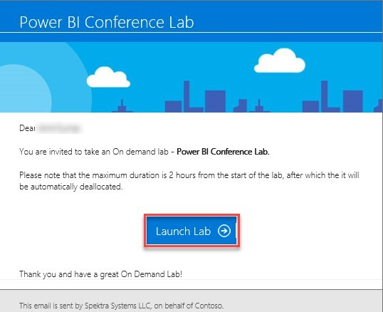
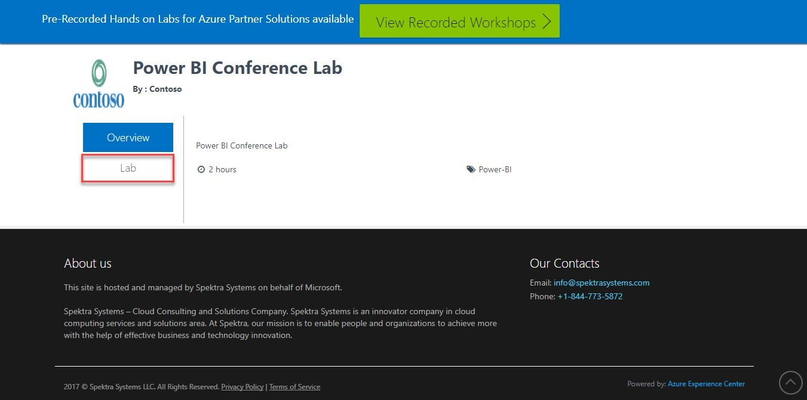
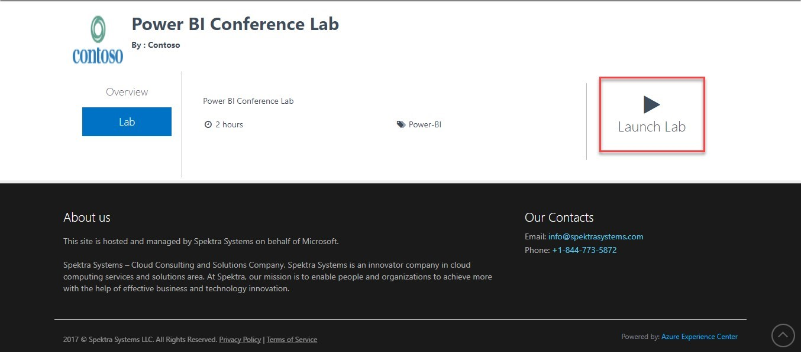
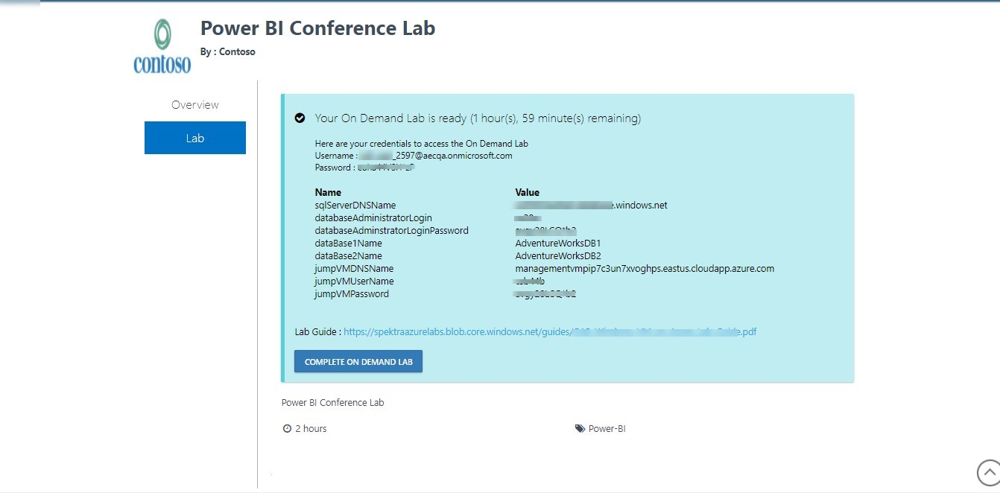
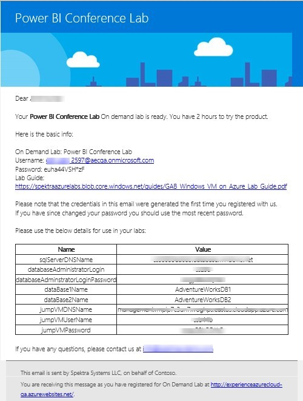

# Power BI Integrated & Azure SQL DB #

[//]: # (This is a comment.)
[//]: # (  this text is defined somewhere in document with reference link when click on that referece here) 
[//]: # (Single # is userd for the largest heading)
[//]: # (Three dashed are used for horrizontal line)

## Table of Contents
[Module 1: Getting Started](#Module1)
- [Lab Overview](#Lab-Overview1)
- [Prerequisites](#Prerequisites1)
- [Time Estimate](#Time-Estimate)
- [Exercise 1: Log into your Azure Portal](#Exercise1.1)
- [Exercise 2: Verify Azure SQL Databases & Other resources in Portal](#Exercise1.2)

[Module 2: Azure SQL Data Visualization with PowerBI](#Module2)

- [Lab Overview](#Lab-Overview2)
- [Exercise 1: Connect to Jump VM via RDP](#Exercise2.1)
- [Exercise 2: Connect Power BI to AzureSQL & Prepare Dashboard’s](#Exercise2.2)

[Module 3: Exploring Azure SQL Database Capabilities](#Module3)
- [Lab Overview](#Lab-Overview3)
- [Prerequisites](#Prerequisites3)
- [Exercise 1: Azure SQL Database Overview](#Exercise3.1)
- [Exercise 2: Database Monitoring](#Exercise3.2)
- [Exercise 3: Connect to azure SQL database via T-SQL in azure portal](#Exercise3.3)
- [Exercise 4: Creating Geo-Replication](#Exercise3.4)
- [Exercise 5: Azure AD Authentication](#Exercise3.5)
- [Exercise 6. Enabling Auditing and Threat Detection](#Exercise3.6)

 

## Module 1: Getting Started ##

### Lab Overview ###
This lab will take you through setting up the lab and verifying access.

#### Prerequisites ###
-	Windows or a Mac machine with HTML5 supported browser such as Microsoft Edge, Internet Explorer, Chrome or Firefox.
-	On a Mac, if you haven’t set up Remote Desktop, please see this [reference](https://docs.microsoft.com/en-us/windows-server/remote/remote-desktopservices/clients/remote-desktop-mac).
-	You should have registered in the training [portal](https://experienceazurecloudqa.azurewebsites.net/#/odl/Power-BI-Conference-Lab/7c5bfb07-be19-4024-8278ea25b2eafe64). After registration, you’d have received an email link below. Click on Launch Lab to start the deployment. You should start the deployment only when you’re ready to execute exercise since this lab will auto- destroy after 2 hours. 

- This will open a new web page, click on Lab.
 

 
•	In this new page, Click on Launch lab.

•	This will start setting up the lab deployment. Note that this process will take 10 to 15 minutes. Once completed, you’d get an email with lab details and the portal should show the lab details. 
 

•	You can use provided Azure credentials to login to Azure. You will also receive same credentials in lab invitation mail. Same credentials can be used to login to powerbi.com, PowerBI Pro license is already associated with his account. 

### Time Estimate ###
10 minutess

### Exercise 1: Log into your Azure Portal ###
In this exercise, you will log into the Azure Portal using your Azure credentials. 
1.	Launch a browser and Navigate to https://portal.azure.com. Provide the credentials that you received via email. Click on Sign In. 
  
Note : At the first login, you will have to change the password, if asked for. 
2.	Enter a new password. Then select Update password and sign in. 
  
3.	Now, you will be directed to the Azure Dashboard 
 
  
 
 
### Exercise 2: Verify Azure SQL Databases & Other resources in Portal ###
In this Lab, you will verify SQL databases and other provisioned resources in Azure portal. 
1.	Launch a browser and navigate to https://portal.azure.com. Login with your Microsoft Azure credentials. 
2.	To toggle show/hide the Portal menu options with icon, Click on the Show Menu button. 
 
        
3.	Click on the Resource groups icon in the Menu navigation bar. 
 
  
4.	Click on the resource group in the Resource group blade 
 
5.	In the blade that appears, click on Overview. 
  
6.	Under the overview section, we can view the SQL database as below. 
 
## Module 2: Azure SQL Data Visualization with PowerBI ##
 
### Lab Overview ### 
In this lab, you will connect Power BI Desktop to Azure SQL DB and prepare dashboards for Adventure works sales and marketing team.  
Please note Power BI Desktop is installed in Jump VM already, however you can also use your own computer which has Power BI desktop client installed to carry out labs in this module.  
Adventure works is a Cycle company and their Sales & Marketing team is intrested in getting following analysis. 
-	Map view with Sales Revenue(Total Due) for each city. Sales team should be able to move over mouse cursor over map to see the total due amount for that city. 
-	Marketing team is intrested in learning about the total revenue based on marketing type i.e sales reason. 
In this module, we will setup dashboard for these requirement. If you’ve Power BI Desktop Client available in your laptop, you can use that to carry out these exercise or you can use Power BI desktop client installed on Jump VM. 
 
 
### Exercise 1: Connect to Jump VM via RDP ###
In this exercise, you will connect to the Jump VM, where you will find tools to perform load test on the Azure SQL DB. 
1.	Click on the Resource groups icon in the Menu navigation bar. 
  
2.	Click on the resource group in the Resource group blade 
  
1.	In the blade that appears, click on Overview. 
  
2.	Under the overview section, click on virtual machine. 
 
 
3.	In the Virtual Machine blade , click on Overview. 
  
4.	Now click on Connect to work on the virtual machine. If you’re using Apple Mac, you can jump directly to Step-12. 
 
5.	On clicking on Connect, the rdp file automatically gets downloaded. Open the downloaded file.  
6.	In the remote desktop window that pops up, Click on Connect. 
 
7.	Now, you will choose the different account and log in with your credentials that you received in mail. 
 
  
 
8.	Enter the Vm Username and Password that you received in the mail. 
 
 
 
10.	Now you are logged into your Virtual Machine 
11.	If you’re using Mac, Copy the Jump VM DNS Name from the email you received. 
12.	Open Microsoft RDP Client from Applications/Spotlight. If you don’t have RDP client installed, you can download it from here: https://itunes.apple.com/in/app/microsoft-remotedesktop/id715768417?mt=12 
13.	In the Connection Center, click + and then click Add PC or Server. 
14.	Enter the following information: 
a.	PC name – Enter the DNS Name Copied from the e=mail 
b.	User name - The user name copied from the email. 
c.	Password – Enter the password copied from -email  
15.	You can also set these optional settings: 
a.	Friendly name 
16.	Click Save. To start the connection, just double-click it. This should open remote session. Please accept certificate warning as required during the connectivity.  
 
### Exercise 2: Connect Power BI to AzureSQL & Prepare Dashboard’s ###
Exercise Overview 
 In this lab, you will add Azure SQL database as data source via Power BI desktop client. 
1.	Login with Jump VM via remote desktop. See Exercise 4 for more information. You do not need to do this if you’ve Power BI Desktop client available on your laptop. 
2.	On Desktop, you should find Power BI Desktop icon. Double click to launch that. 
             
3.	After open, the Power BI desktop you will below screen. Click on the sign in to sign in with power bi account. 
             
4.	In sign in window enter your Power BI id, use the azure username password received in email. 
• After entering the Power BI id, click on the Sign in. 
 
  
 
5.	Now you need to enter your Power BI password and then click on login as in below screen shot. 
 
  
 
6.	After Sign in you will see screen as the canvas. Now in the upper right corner see you Power Bi username labeled as 1. After that, click on the Get Data labeled as 2 in canvas. 
   
7.	You are connecting to Azure SQL database so click on Azure. 
 
  
 
8.	Now select the Azure SQL database and then click on the connect button. 
 
  
 
 
9.	Now you have to enter the SQL server URL and database name. 
 
  
 
 
10.	We need to have SQL server url to connect, you can find it in the e-mail you received with lab details or find from Azure portal. Following steps describes where you can find this in azure portal. 
Goto https://portal.azure.com, then inside your resource group get in SQL server. 
 
   
11.	Go to the Properties of SQL server. 
  
 
12.	In Properties blade make a note of server name. 
 
   
13.	Now go back to your Power BI desktop client and fill in SQL Server details as specified below 
•	Server: As noted in last step 
•	Database: Enter the database name i.e. “AdventureWorksDB1” 
•	Username: Enter username you got in lab details mail. 
•	Password: Enter password you got in lab details mail. 
14.	Now enter the server url and database name. Then select the DirectQuery for live connection with Azure SQL server and drop down the advance tap to for navigating in hierarchy of database.  
 
  
 
15.	Now check the checkbox: Navigate using full hierarchy. Now click ok. 
 
  
 
16.	Now to connect with Azure SQL you need to verify the window and SQL server credentials. So, select the radio button of Use my credentials and then click on Database to enter Azure SQL credentials.  
 
  
 
17.	Now enter the Username and Password of Azure SQL server that you received in lab detail mail after that click on the connect button. 
 
  
 
18.	Now you will see the all the data coming in AdventureWorks1 database. Expand the person folder to see the tables inside it. 
 
  
 
 
19.	Now, Inside the person folder select the table named as Address. 
20.	After that expand the sales folder also. 
 
 
   
21.	Inside the sales folder select the following tables: 
•	SalesOrderDetail 
•	SalesOrderHeader 
•	SalesOrderheaderSalesReason 
•	SalesReason 
Now, click on the Load to load the selected tables. 
  
 
22.	You will see the selected tables loaded and we can see the tables under FIELDS blade, now click on the relationship icon marked in left side below the paste icon.  
 
  
23.	You can manage the relationships between tables data by Manage Relationships function under Home tab of menu bar. So, click on Manage Relationships 
 
   
24.	Now, select relationships one by one and edit these relations by edit button. 
 
  
25.	Now you must ensure that following properties as: 
•	Make the relationship active 
•	Cross filter direction: Both 
Then click on OK button. 
You have to do it for all the relationships in previous step. 
 
   
26.	After editing all the relationships click on Report icon below the paste icon as in below canvas. 
 
   
27.	Now in report blade under FIELDS area select Address table to choose columns for creating report. 
 
   
28.	Now, select the City Column and after that, expand the SalesOrderHeader table. 
 
 
29.	Now select the TotalDue column. 
 
 
 
30.	You can see the report blade in the left side under white background area. You can resize the report as select, drag and drop the right below corner of report blade. 
 
 
31.	When you move your mouse hover on the green icon in map view you can see the TotalDue by  City as canvas. 
  
32.	Rename the Page 1 by right click on it and then select Rename page. Rename the page as Sales by City. 
 
   
33.	You can see the renamed page in below screen, now click on the + sign to add new page. 
 
   
34.	Now under SalesOrderHeader table select the TotalDue Column and under SalesReason table select Name for preparing report TotalDue by name. 
 
   
35.	You can see the report on screen, now click anywhere in black area to generate another report on same page. 
 
  
36.	Now select City under the Address table and then resize the map view report by expanding from the right lower corner. Now click in blank area as blue stamp in the below screenshot. 
  
 
 
37.	Now click on the OrderDate under SalesOrderHeader table. Then you can see the report Orderdate labeled as 3. Now click on the Slicer icon under Visualization labeled as 4 for filtering the report on page level by order date. 
 
   
38.	You can see the report area after selecting the slicer Visualization. Rename the current page as Sales by name and city [Filtered by Date]. 
 
   
39.	Now you can see the renamed page than click on the + icon to add a new page. 
 
   
40.	Now select the ModifiedDate and SalesPersonID under SalesOrderHeader table in FIELD area blade. You can see the report labeled as 3. Now choose the Line Chart view under the visualization area to change the report in Line chart view. 
  
 
 
41.	Now resize the Line Chart report by expanding it from the lower right corner as in below canvas. 
 
   
42.	Now you can see the report on the whole page after resizing the report. Rename the page SalesPersonID by ModifiedDate. 
 
   
43.	Now you can see the modified name of the page as SalesPersonID by ModifiedDate. Click on + icon to add a new page.  
 
   
44.	Now select the TotalDue under SalesOrderHeader table and Name under SalesReason. Now Change the view by clicking on the Pie Chart icon under visualization labeled as 4. 
 
   
45.	You can see the pie chart report of TotalDue by Name. Rename the page as PieChart [TotalDue by Name] and add a new page by clicking the + icon. 
 
  
46.	Now Select the TotalDue and ReasonType and click on Funnel icon under the visualization.  
 
   
47.	This is the Funnel view of report. on mouse hovering on the funnels you can see the TotalDue by ReasonType. Rename the page as TotalDue by Reason and then publish the report to the Power BI online by clicking on the Publish button in upper right corner. 
 
   
48.	When you click on the Publish Report it will ask you to save the report then click on the save button. 
 
  
 
49.	Give File Name as AdventureWorksDB1 and save the report. 
 
   
50.	Now you see a window pop up’s Published succeeded, Click on the Open ‘AdventureWorksDB1.pbix’ in Power BI. 
 
  
 
51.	Now you need to SIGN IN to Power BI online. 
 
  
 
 
52.	SIGN IN with same ID as you Signed IN in Power BI desktop. After entering your id click on Next button. 
 
  
 
53.	Enter your password and click on Sign In. 
 
  
 
 
54.	You need to enter the credentials of Azure SQL Data to connect with data source for live connection. Click on the Enter Credentials. 
  
 
 
55.	After clicking on edit credentials you will redirected to the below screen. Then ensure you are under Datasets tab and AdventureWorksDB1 is selected. Then click on the Edit Credentials. 
 
   
56.	Enter Azure SQL server Credential you received by lab invitation mail. After entering the User Name and the Password click on the Sign IN button. 
  
 
 
57.	You will see the following notification after Sign In: SqlServer Data Source updated. 
 
  
 
 
58.	Now click on the drop down icon of My Workspace in left side of your system screen. 
 
   
59.	Now click on the AdventureWorksDB1 under Reports to see you published report from the Power BI Desktop. 
 
   
60.	You can see the all reports you published now Click on Sales by City Report. 
 
  
 
 
61.	Now click on the Pin icon to pin the report on Dashboard.  
 
   
62.	As you don’t have any existing dashboard so click on the New dashboard radio button. Name the dashboard as Dashboard [AdvantureWorks] then click on the PIN button. 
   
63.	Now Click on Dashboard [AdvantureWorks] under Dashboard Tab. Similarly, you can pin more report on you dashboard.  
 
  
 
 
64.	Look on below dashboard contains more the one report as I also pinned another report to the dashboard. 
   
65.	You can prepare report from here also by from your DATASETS AdventureWorksDB1. 
 
  
 
 
 
 
## Module 3: Exploring Azure SQL Database Capabilities ##
 
### Lab Overview ###
This lab will take you through database overview and monitoring of database. 

### Prerequisites ###
• Windows or a Mac machine with HTML5 supported browser such as Microsoft Edge, Internet Explorer, Chrome or Firefox 

### Exercise 1: Azure SQL Database Overview 
1.	Launch a browser and navigate to Azure portal. Login with your Microsoft Azure credentials. 
2.	To toggle show/hide the Portal menu options with icon, Click on the Show Menu button. 
 
        
3.	Click on the Resource groups icon in the Menu navigation bar. 
 
  
4.	Click on the resource group in the Resource group blade 
  
17. In the blade that appears, click on Overview. 
  
5.	Under the overview section, click AdventureWorksDB1. 
 
6.	In the Database blade that appears, click on Overview. 
 
7.	Under the overview section of the database, you can view the resource group, subscription and location where it is deployed and also other details of database as shown below. 
 
 
8.	In overview blade, you can also see the DTU Utilized %age, which shows the current utilization % for the SQL DB. You’ll see that it’s almost 0% most of the time. 

### Exercise 2: Database Monitoring ###
1.	In the Database blade, click on Performance overview under Support + Troubleshooting. 
 
 
2.	Under Performance overview section, you will see the performance graphs as below. This includes DTU Utilization along with CPU %, Data IO and Log IO utilization. 
   
3.	The first graph shows the overall DTU usage for the selected number of queries in a chosen period. 
 
   
4.	The second graph shows the database CPU usage, database IO usage and database log IO usage in a chosen time period. 
 
   
5.	In the Database blade, click on Query Performance Insight under Support + Troubleshooting. 
 
 
6.	Under the Query Performance Insight, select the Resource consuming queries 
 
7.	Under Resource consuming queries section, you can view graph as below. This shows utilization dashboard with respect to queries consuming resources.  
 
   
8.	Under the Query Performance Insight, select the Long running queries 
 
9.	Under Long running queries section, you can view graph as below for queries running for longer duration. 
 
  
 
10.	Under the Query Performance Insight, select Custom. 
 
11.	Under Custom section, you can custom the view of the graph by providing different values for the Metric type, Time period, Number of queries and Aggregation type. 
 
 
   
### Exercise 3: Connect to azure SQL database via T-SQL in azure portal ###
 
In this exercise, you will connect to Database via T-SQL in azure portal and execute T-SQL queries fetching some data. 
1.	Launch a browser and Navigate to https://portal.Azure .com. Login with your Microsoft Azure credentials. 
2.	Navigate to database AdventureWorkssDB1. 
 
 
3.	In the db1 blade that appears, click “tools” tab at the top. 
 
4.	Now, choose Query Editor (preview) option in "Tools" menu. 
 
5.	Before getting SQL Query Editor, we need to accept the preview terms, then we will get SQL Query Editor. 
              
6.	Before executing queries against our database, select SQL server authentication for Authorization type and login with SQL Server credentials provided in the mail.  
             
7.	Now you can see user is successfully logged in. 
             
8.	Now, you can run many common queries in this editor, such as create new database, table, display table data, edit table data, create a stored procedure, or drop table. For example, let’s try executing query for getting all the table in the database. Execute following query for this. 
 
SELECT * FROM INFORMATION_SCHEMA.TABLES WHERE TABLE_TYPE='BASE TABLE'          
 
9.	Now Let’s look at the Top 10 records for Sales.Customers table. Execute following query 
SELECT TOP 10 * FROM Sales.Customer 
10.	Similar you can use this query editor to interact with Azure SQL database using T-SQL. 
 
 
 
### Exercise 4: Creating Geo-Replication ###
Exercise Overview 
 In this lab, you will create a geo replication. Geo replication enables replicating your database to a different azure region.  
1. Launch a browser and navigate to Azure portal. Login with your Microsoft Azure credentials. 2. Navigate to resource group>overview>AdventureWorksDB1 
 
 
3.	In the AdventureworksDB1 blade that appears, click on Geo-Replication under settings. 
 
4.	Now for geo replication, you first need to decide which region you would like to use for the secondary. Portal shows the paired Azure region as recommended on top. 
 
5.	Choose the region you’d want to setup replication too. Please make sure to choose only US regions for this lab purpose. 
6.	This will open create secondary blade. Verify the Region is same as selected and click on target server. 
7.	Choose a new Server with following specifications 
Server name: Your unique SQL server name for different region. This must be unique across Azure. 
Login and Password: Credentials for new server 
 
  
 
 
8.	Verify all settings as specified below. 
 
 
9.	Now, you can see the replication in progress. 
     
 
 
10.	It will take few minutes for the databases to get in sync. 
 
11.	See this for more information about how you can failover etc. 
 
### Exercise 5: Azure AD Authentication ###
Exercise Overview 
 In this lab, you will enable Azure AD Authentication for SQL DB and connect to the db using automatic Azure AD Authentication. 
1.	Launch a browser and navigate to Azure portal. Login with your Microsoft Azure credentials. 
2.	Navigate to resource group>overview and select the SQL Server (NOT one of the SQL databases). 
 
 
3.	Navigate to Active Directory admin for the SQL server, Click on Set admin. 
 
 
4.	Search for your own Azure AD Account (This is your azure login username for the lab) 
             
 
5.	Now, new blade that appears, click on Save. 
 
 
6.	Now, you can see the admin is successfully saved. 
 
 
7.	Now go into database AdventureWorksDB1. 
 
8.	In the overview blade, click “tools” tab. 
9.            
 
10.	Now, choose Query Editor (preview) option in "Tools" menu. 
 
11.	Now, you can see the user is automatically logged in using Azure AD authentication, there wouldn’t be any need for SQL Authentication. 
             
 
### Exercise 6. Enabling Auditing and Threat Detection ###
Exercise Overview 
 In this lab, you will enable Auditing and thread detection which secures your database. 
 
1.	Launch a browser and navigate to Azure portal. Login with your Microsoft Azure credentials. 
2.	To toggle show/hide the Portal menu options with icon, Click on the Show Menu button. 
 
        
3.	Click on the Resource groups icon in the Menu navigation bar. 
 
  
4.	Click on the resource group in the Resource group blade 
  
5.	In the blade that appears, click on Overview. 
  
6.	Under the overview section, click on AdventureWorksDB1. 
 
7.	In the Database blade that appears, click on Auditing &Threat Detection under the settings. 
 
 
8.	Under the Auditing and Threat Detection section of the database, switch Auditing to On. Once auditing is on, Threat Detection also will become active. Now switch Threat Detection to On to enable threat detection. 
 
 
9.	Click on Storage details. 
 
   
10.	In the Audit logs storage blade that appears, click on Storage account and choose the storage account available. Set the Retention days as per your needs and click on OK. 
 
   
11.	Back in the Audit & Threat Detection,enter the email address in the Send alerts to box and click on Save at the top of the blade. 
 
  
 
12.	Click on OK in the message that pops up. 
 
  
13.	Now you can Click on View audit logs. This will show all login/other activities performed by users along with user details. 
 
 
 
 
 
 
